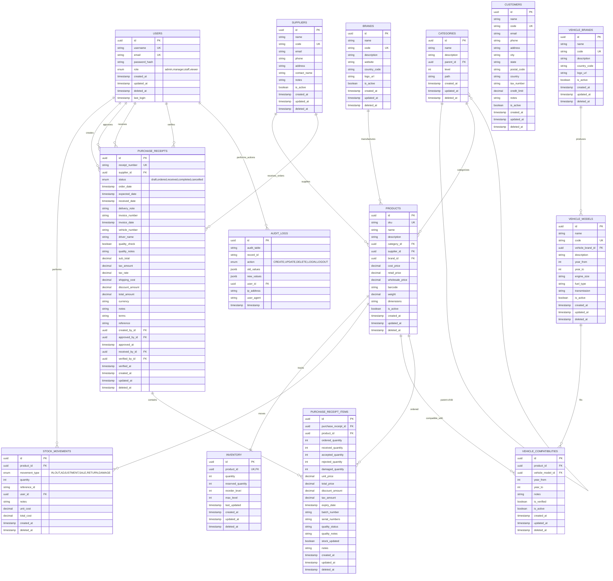

# Hardware Store Inventory Management System - Entity Relationship Diagram

## Key Relationships Summary

### **Core Product Management**
- Categories have hierarchical parent-child relationships
- Products belong to categories, suppliers, and brands
- Each product has exactly one inventory record

### **Simplified Stock Management** 
- Single-location inventory tracking per product
- Stock movements log all inventory changes with user attribution
- No location management complexity

### **Vehicle Compatibility**
- Vehicle brands contain multiple models
- Products can be compatible with multiple vehicle models
- Compatibility includes year ranges and verification status

### **Unified Purchase Workflow**
- **Purchase Receipts** combine ordering and receiving in one table
- Purchase Receipt Items track ordered vs received quantities
- Quality control and batch tracking at item level
- Single workflow from order to completion

### **Audit & Security**
- All user actions are logged in audit_logs
- Role-based access control through user roles
- Soft deletes preserve data history

### **Business Logic Constraints**
- UUID primary keys throughout for distributed systems
- Unique constraints on codes/SKUs for business identification  
- Decimal precision for financial calculations
- Timestamps for audit trails and soft deletes
- Boolean flags for active/inactive states

### **Simplified Features**
- **Removed**: Multiple locations, separate PO/GRN tables, location-based stock tracking
- **Added**: Unified Purchase Receipts for simplified order-to-receipt workflow
- **Result**: Cleaner, single-location hardware store inventory system

This ERD represents a simplified hardware store inventory system perfect for single-location operations with vehicle spare parts specialization and streamlined purchase management.