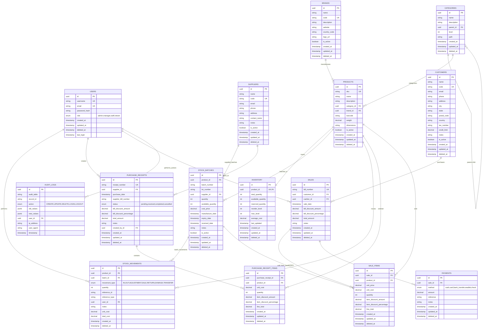

# Hardware Store Inventory Management System - Entity Relationship Diagram

## Key Relationships Summary

### **Simplified Product Management**
- Categories have hierarchical parent-child relationships
- Products belong to categories and brands
- Each product has exactly one inventory record with average cost tracking

### **Batch-Level Stock Management** 
- **Stock Batches** track individual lots with expiry dates and cost prices
- **Stock Movements** link to specific batches for granular tracking
- Inventory maintains totals while batches track individual stock lots
- FIFO/LIFO cost calculation supported through batch tracking

### **Transaction-Based Pricing System**
- **Purchase Receipt Items** store supplier-specific data (SKU, cost, pricing suggestions)
- **Sale Items** store all pricing data (retail/wholesale/custom prices) 
- Historical pricing automatically preserved in transaction records
- No separate pricing tables - everything in transaction context

### **Minimal Purchase Workflow**
- **Purchase Receipts** with essential fields only:
  - Purchase date, supplier, and supplier bill number
  - Status tracking (pending, received, completed, cancelled)
  - Bill discount (amount or percentage) for the entire purchase
  - Total amount and notes
- **Purchase Receipt Items** with minimal data:
  - Product, unit cost, quantity
  - Item-specific discount (amount or percentage)
  - Line total

### **Minimal Point of Sale System**
- **Sales** with essential fields only:
  - Unique bill numbers for easy lookup
  - Sale date, customer, and cashier
  - Bill discount (amount or percentage) for the entire sale
  - Total amount and notes
- **Sale Items** with minimal data:
  - Product, unit price, unit cost, quantity
  - Item-specific discount (amount or percentage)
  - Line total for immediate profit calculation

### **Audit & Security**
- All user actions are logged in audit_logs
- Role-based access control through user roles
- Soft deletes preserve data history

### **Business Logic Constraints**
- UUID primary keys throughout for distributed systems
- Unique constraints on codes/SKUs for business identification  
- Decimal precision for financial calculations
- Timestamps for audit trails and soft deletes
- Boolean flags for active/inactive states

### **Core Features Implemented**
- ✅ **Purchase management** - Date, supplier, supplier bill number, status tracking
- ✅ **Sale management** - Bill numbers for instant lookup, customer tracking
- ✅ **Multi-level discounts** - Both item-level and bill-level discounts (amount or percentage)
- ✅ **Cost tracking** - Unit costs in sale items for immediate profit calculation
- ✅ **Batch tracking** - Stock batches for separate inventory management
- ✅ **Simple P&L calculation** - Revenue from sales, costs from purchase/sale data

### **Minimal Design Benefits**
- **Ultra-simple structure** - Only essential fields, no unnecessary complexity
- **Flexible discounts** - Both item and bill level, amount or percentage
- **Instant profit** - Cost vs price visible in every sale item
- **Easy queries** - Minimal joins, straightforward data access
- **Quick implementation** - Fewer fields to validate and manage

### **Supported Business Operations**
- Purchase tracking with supplier bill references
- Sale tracking with unique bill numbers for instant lookup
- Flexible discount application (per item or entire bill)
- Immediate profit calculation (unit_price - unit_cost) × quantity
- Batch-level inventory management
- Simple P&L: Sum(sale_line_totals) - Sum(purchase_line_totals)

This ERD represents a **minimal but complete inventory and POS system** that:
- Contains only the essential fields you actually need
- Supports flexible discount strategies
- Provides immediate profit visibility
- Requires minimal setup and maintenance